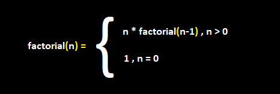

# <center>Elixir in a nutshell <br>       </center>

# Summary
* What is Elixir?[^1]
* What is a functional language?[^2]
* Functional Language vs Object Oriented Language[^3]
* Why Elixir?[^4]
* Hello world in Elixir.[^5]
* What I like about Elixir.[^6]
* What I dislike about Elixir.[^7]
* Why do I prefer Elixir over Lisp.[^8]

## [^1]: What is Elixir?

**Elixir is a dynamic, functional language for building scalable and maintainable applications.**  <br>
Elixir runs on the [Erlang VM](https://www.erlang.org/), so just like Java it is compatible with any operating system.
It is known for creating low-latency, distributed, and fault-tolerant systems. These capabilities and Elixir tooling allow developers to be productive in several domains, such as web development, embedded software, data pipelines, and multimedia processing, across a wide range of industries.

Here is a peek:
```elixir
# This function reads a number from a file 
# and returns it
def read() do
  {age, _} = IO.gets("Give: ") |> Integer.parse()
  age
end
```

## [^2]: What is a functional language?
&nbsp; Functional programming languages are designed on the concept of **mathematical functions** that use **conditional expressions** and **recursion** to perform computation.
* For example, let's take this problem: <br>

&nbsp; Given an integer n (bigger than 0 and smaller than 100) find it's factorial. (the factorial of a number is each positive integer smaller than it multiplied by it, 4! = 1\*2\*3\*4 = 24) <br>
&nbsp; In an *Object Oriented Language* you'd use a loop, but in functional languages we use *recursion*. <br>
&nbsp;  Frist let's make the mathematical function and than we will write the code.

 <br>

&nbsp; The elixir code for this code could be:
```elixir
def factorial(n) do
      cond do
        n > 0 -> n * factorial(n-1)
        true -> 1
    end
end
```

## [^3]: Functional Language vs Object Oriented Language
&nbsp; We covered what a functional language is, but what is an object oriented language?
<p> Object-oriented language (OOL) is a high-level computer programming language that implements objects and their associated procedures within the programming context to create software programs.
Object-oriented language uses an object-oriented programming technique that binds related data and functions into an object and encourages reuse of these objects within the same and other programs. </p>

&nbsp; To better understand the differences between the two let's solve some problems: <br>
Let's say we have two numbers x and y and we want to find their sum squared.

&nbsp; In an OOL we might solve the problem like this:
```python
def sum_squared(x, y):
  sum = x + y
  square = sum ^ 2
  return square
```
This is a fair approach , but there are some 'problems': for example the use of variables sum and square, using variables takes memory and this influences the program outside of the function.

A functional programming approach would look more like this :
```python
def sum_squared(x, y):
  return (x + y) ^ 2 
``` 
<sub>(this code was written in python)</sub>


